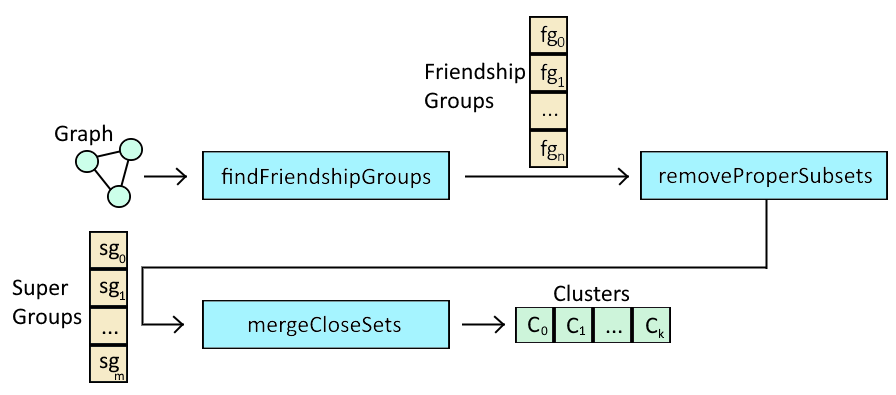
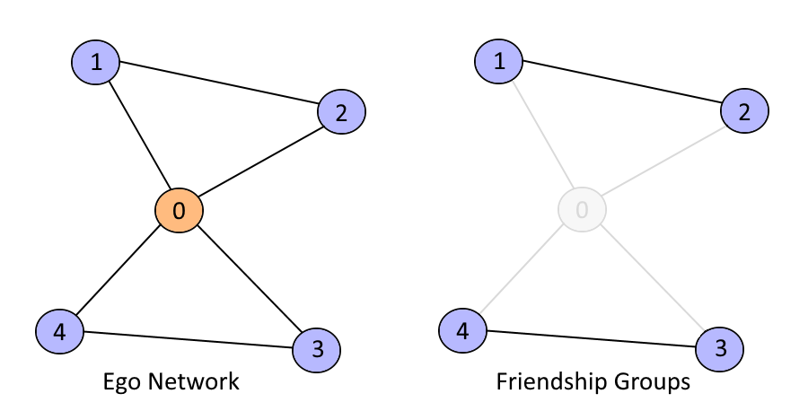
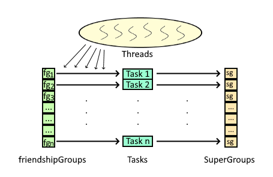
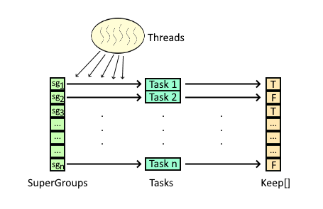
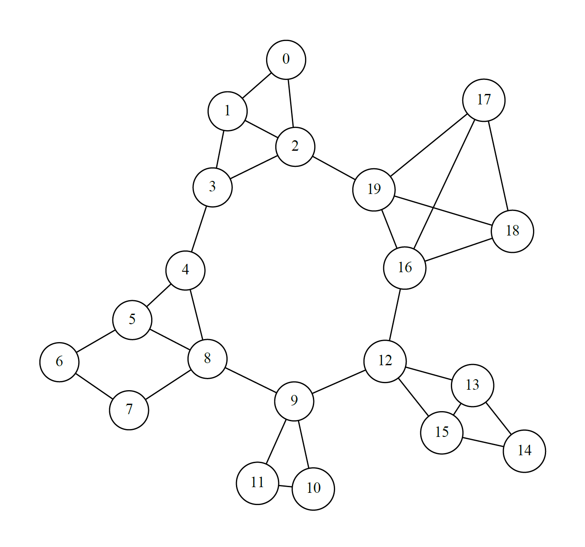
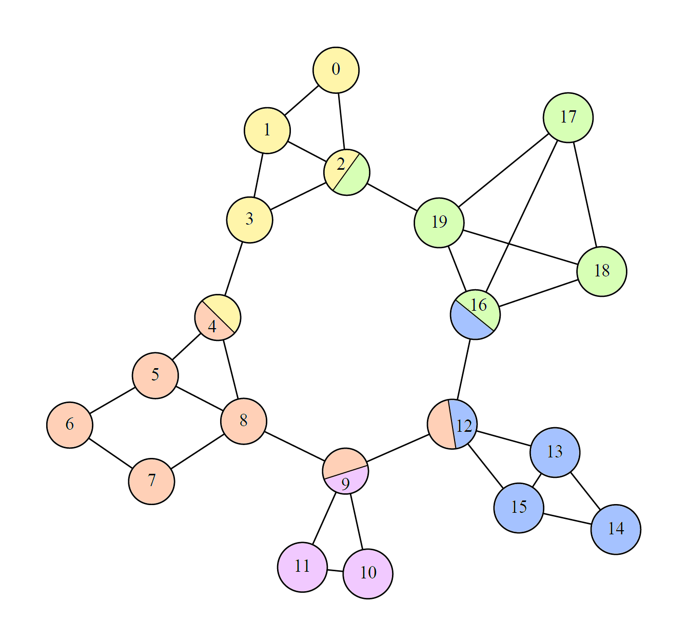
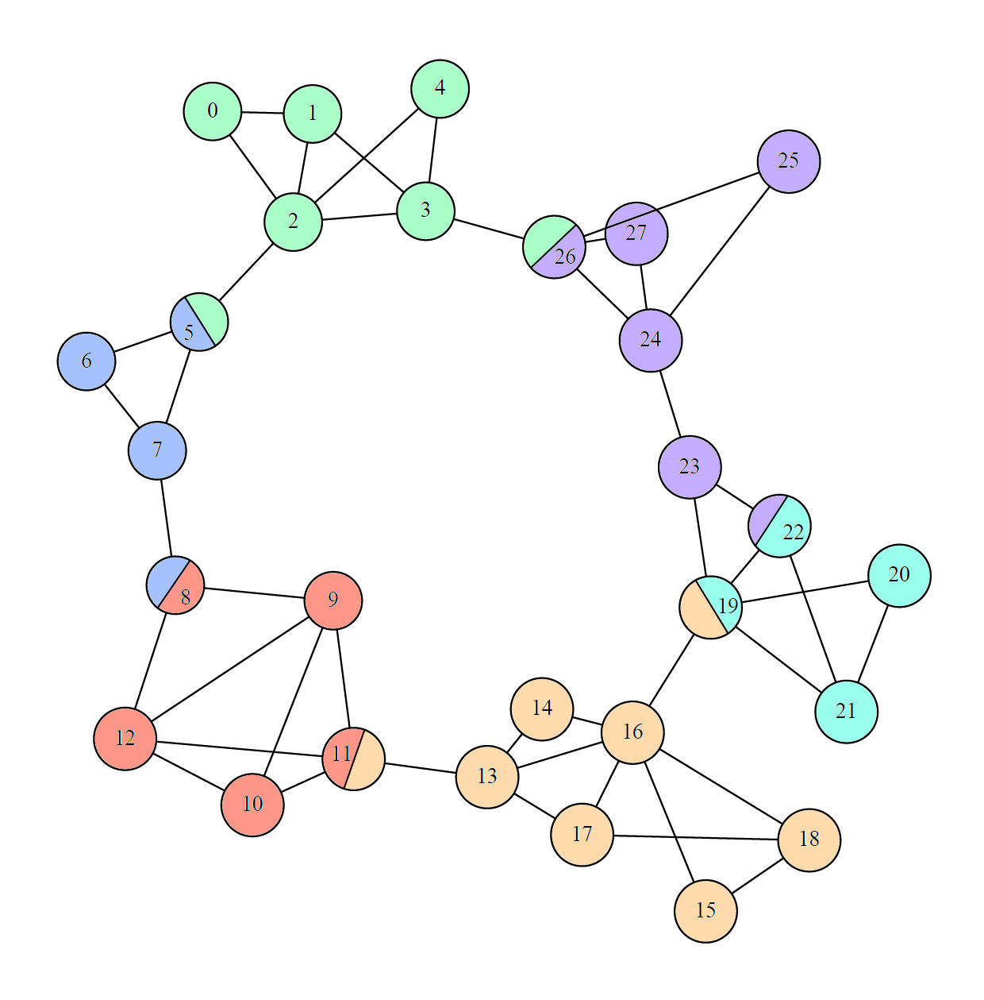

# Overlapping Community Detection in JGraphT

A Java implementation of an **egonet-based overlapping community detection algorithm** for the [JGraphT](https://jgrapht.org/) graph library, developed as the practical component of a Bachelor Thesis.

Unlike conventional clustering methods that assign each vertex to exactly one cluster, this project is designed to detect **overlapping communities**, allowing a vertex to belong to multiple communities at the same time. The implementation builds local community views from ego networks, extracts *friendship groups*, removes redundant groups, and progressively merges related groups into the final community structure.

The project was developed with the intention of eventual integration into JGraphT: the implementation is generic in vertex and edge types, uses JGraphT's graph and clustering abstractions, and includes explicit support for **parallel execution** in the stages where operations can be performed independently.





## Overview

Community detection aims to identify groups of vertices that are more strongly related to one another than to the rest of a graph. Many classical clustering algorithms produce a strict partition, meaning that every vertex belongs to one and only one community.

That restriction is not always realistic. In a social network, for example, the same person may simultaneously belong to family, professional, academic, and social groups. Similar overlap can appear in biological, communication, and information networks. For such cases, an algorithm must be capable of identifying communities **without requiring them to be mutually exclusive**.

This project implements an approach based primarily on the work of **Bradley S. Rees and Keith B. Gallagher**, *Overlapping Community Detection by Collective Friendship Group Inference*. Their method builds a global community structure from the local perspective of each vertex. In this implementation, that process is adapted to the JGraphT API and extended with parallel task execution for the stages that can safely be evaluated independently.

### Main goals

- Implement overlapping community detection using **ego networks and friendship groups**.
- Develop an independent, reusable **`EgonetGraphGenerator`** for JGraphT graphs.
- Implement the clustering algorithm through JGraphT's **`ClusteringAlgorithm<V>`** interface.
- Preserve support for generic JGraphT vertex and edge types.
- Explore and implement safe **multithreaded execution**.
- Evaluate the practical effect of different thread counts on execution time.
- Keep the code structured in a way that could be refined toward integration into JGraphT.

## Academic Context

The project was developed for the Bachelor Thesis **"Graph Algorithms in JGraphT"** at the Department of Informatics and Telematics, Harokopio University of Athens, during the 2021–2022 academic year, under the supervision of Professor Dimitrios Michail.

The thesis contains a broader study of graph theory and community-detection techniques, including Girvan-Newman, modularity-based methods, Louvain, ego networks, overlapping communities, implementation decisions, and experimental evaluation.

## How the Algorithm Works

The algorithm infers a global community structure by combining many local views of the graph.

For every vertex, the vertex is temporarily treated as an **ego**. An ego network is generated around it, the ego itself is removed, and the connected components that remain are identified. Each component is then combined again with the ego to form a **friendship group**.

Repeating this for every vertex produces a collection of local candidate groups. Those groups are then reduced and merged until no further valid merges can be performed.





The important consequence is that the same vertex can appear in friendship groups derived from different local perspectives. The final result therefore does not have to be a disjoint partition: **community overlap is preserved naturally**.

## Execution Pipeline

The main `OverlappingClustering` implementation divides the process into three stages:

```text
Input Graph
    |
    v
findFriendshipGroups()
    |
    v
removeProperSubsets()
    |
    v
mergeCloseSets()
    |
    v
ClusteringImpl<V>
```

### 1. Friendship-group discovery

`findFriendshipGroups()` processes every vertex in the graph as a separate ego.

For each vertex:

1. a target graph with the same graph type is created with `GraphTypeBuilder`;
2. an `EgonetGraphGenerator` is instantiated using the configured radius;
3. the egonet is generated with `includeEgo = false`;
4. `ConnectivityInspector` finds the connected components of the remaining egonet;
5. the ego vertex is added back to each connected component;
6. each resulting set becomes a friendship group.

Duplicate friendship groups are eliminated by storing them in a `Set<Set<V>>` before transferring them to the internal list.

This stage is implemented by the nested task:

```java
FriendshipGroupsTask implements Callable<Set<Set<V>>>
```

Each graph vertex produces one task, which means the local analysis of different egos can be executed independently.

### 2. Proper-subset removal

The friendship-group collection can contain groups that are completely contained inside larger groups. These smaller groups do not add additional information and are removed before the merge stage.

For two groups `A` and `B`, the implementation considers `A` a proper subset of `B` when:

```text
B contains every element of A
and
A != B
```

This is implemented directly by:

```java
boolean isProperSubset(Set<V> setA, Set<V> setB)
```

Every friendship group is checked against the complete collection. A `ProperSubsetsTask` returns the index of a group only when it is **not** a proper subset of another group. The surviving groups are copied into `superGroups`.

```java
ProperSubsetsTask implements Callable<Optional<Integer>>
```

### 3. Iterative merging of close groups

The final stage, `mergeCloseSets()`, repeatedly merges groups that are considered sufficiently close.

The implementation first treats the smaller of two groups as `setA`, calculates the intersection, and computes:

```text
proximity = |setA| - |setA ∩ setB|
```

The groups are considered close when:

```text
proximity <= 1
```

In other words, **all but at most one member of the smaller group must also occur in the larger group**.

When two groups satisfy this rule, the second group is merged into the first. The algorithm performs repeated passes over the current group collection until a complete pass produces no additional merge.

This stage is deliberately greedy and sequential because merges change the sets that subsequent comparisons operate on.

## `OverlappingClustering<V, E>`

The primary class is located in the JGraphT clustering package and implements the library's clustering interface:

```java
public class OverlappingClustering<V, E>
    implements ClusteringAlgorithm<V>
```

The class operates on a `Graph<V, E>` and ultimately returns a standard JGraphT `Clustering<V>` through `getClustering()`.

### Internal state

| Field | Purpose |
| --- | --- |
| `graph` | Input graph to analyze |
| `parallelism` | Maximum number of worker threads associated with the executor |
| `executor` | `ThreadPoolExecutor` used for parallel stages |
| `radius` | Radius supplied to each egonet calculation |
| `friendshipGroups` | Unique local groups extracted from all egonets |
| `superGroups` | Friendship groups remaining after proper-subset removal |
| `mergedGroups` | Final groups after iterative close-set merging |

### Defaults

The source defines:

```java
public static final int DEFAULT_PARALLELISM =
    Runtime.getRuntime().availableProcessors();

public static final int DEFAULT_RADIUS = 1;
```

This makes the intended default thread count follow the number of processors made available to the JVM.

### Constructors

The implementation provides constructors for either an existing executor or an explicitly requested parallelism level:

```java
OverlappingClustering(
    Graph<V, E> graph,
    ThreadPoolExecutor executor,
    int radius)
```

```java
OverlappingClustering(
    Graph<V, E> graph,
    int parallelism,
    int radius)
```

The second form creates its executor through JGraphT's `ConcurrencyUtil.createThreadPoolExecutor()`.

The source also contains a two-argument constructor:

```java
OverlappingClustering(Graph<V, E> graph, int k)
```

In the current implementation, `k` is not used to select a number of communities; the constructor delegates to the default parallelism and radius. The algorithm itself **does not require the desired number of communities in advance**. For unambiguous use, the explicit `(graph, parallelism, radius)` constructor is preferable.

## `EgonetGraphGenerator<V, E>`

The second major component is the reusable egonet generator:

```java
public class EgonetGraphGenerator<V, E>
    implements GraphGenerator<V, E, V>
```

It receives a source graph and an ego vertex and generates a new graph containing vertices reachable from that ego according to the selected search strategy.

### Configuration

| Parameter | Description | Default |
| --- | --- | ---: |
| `graph` | Source graph | required |
| `ego` | Vertex used as the center of the egonet | required |
| `radius` | Requested search radius | `1` |
| `includeEgo` | Keep or remove the ego from the generated graph | `true` |
| `newEdges` | Create target edges instead of reusing source edge objects | `true` |

Several constructor overloads allow the optional parameters to be omitted.

### Supported graph behavior

The generator requires a graph that JGraphT recognizes as directed or undirected.

If the input graph is weighted, the source wraps it with:

```java
new AsUnweightedGraph<>(...)
```

This is intentional: edge weights are not used to determine friendship-group membership in this implementation.

The generator selects a shortest-path strategy according to graph direction:

- **undirected graph:** the project's radius-aware `BFSShortestPath`;
- **directed graph:** `DijkstraShortestPath`, using its radius-limited search support.

After the vertices belonging to the generated egonet have been selected, the generator scans the original graph and reconstructs edges between vertices present in the target graph.

### `includeEgo`

The ability to exclude the ego is essential to the main clustering algorithm. `FriendshipGroupsTask` creates the generator as:

```java
new EgonetGraphGenerator<>(graph, vertex, radius, false)
```

The resulting graph therefore contains the ego's local neighborhood without the central vertex. Its connected components can then be interpreted as separate friendship groups, after which the ego is added back to each group.

### `newEdges`

When `newEdges` is `true`, the target graph creates its own edge objects. When it is `false`, the generator attempts to reuse the edge objects from the source graph.

This option makes the generator more flexible when the resulting egonet is to be manipulated independently from the original graph.

## `BFSShortestPath<V, E>` (updated with optional radius)

To support radius-limited egonet generation on undirected graphs, the project includes a modified `BFSShortestPath` implementation under `org.jgrapht.alg.shortestpath`.

The standard breadth-first search behavior is extended with an optional radius parameter that limits traversal by distance from the source vertex. The original graph-only constructor is retained and delegates to an unbounded radius, while `EgonetGraphGenerator` uses the radius-aware constructor so that only vertices within the requested number of hops from the ego are included.

This provides undirected egonet generation with the same configurable radius behavior that `DijkstraShortestPath` supplies for directed graphs.

## Parallelization

Parallel execution is a central implementation feature rather than an external wrapper around the algorithm.

The code uses:

```java
ExecutorCompletionService
ThreadPoolExecutor
Callable
```

and creates a separate task for each independent unit of work.

### Friendship-group tasks

Every vertex can have its egonet and friendship groups calculated independently. `findFriendshipGroups()` therefore submits one `FriendshipGroupsTask` per graph vertex.

Results are collected using `CompletionService.take()`, so the main thread can process completed work as soon as any worker finishes instead of waiting for tasks in submission order.

### Proper-subset tasks

Proper-subset testing is also parallelized. Each `ProperSubsetsTask` checks one friendship group against the remaining collection and returns either:

- `Optional.of(index)` if the group should be retained; or
- `Optional.empty()` if it is a proper subset and should be removed.

The results populate a boolean keep-mask, from which `superGroups` is constructed.






### Why `mergeCloseSets()` is sequential

The final merge stage was also investigated as a candidate for parallelization, but parallel execution was not retained.

A merge changes the set being compared with later candidates. Two potential merges may also depend on the same group. Executing such operations concurrently can therefore alter the set of subsequent valid merges and produce results that differ from the sequential greedy procedure.

The final implementation intentionally parallelizes only the stages where task independence can be maintained without changing the algorithm's semantics.

## Usage

### Running the clustering algorithm

A direct use of the main implementation can be written as:

```java
Graph<Integer, DefaultEdge> graph =
    new SimpleGraph<>(DefaultEdge.class);

// Populate graph...

OverlappingClustering<Integer, DefaultEdge> algorithm =
    new OverlappingClustering<>(
        graph,
        OverlappingClustering.DEFAULT_PARALLELISM,
        OverlappingClustering.DEFAULT_RADIUS);

ClusteringAlgorithm.Clustering<Integer> clustering =
    algorithm.getClustering();

for (Set<Integer> community : clustering.getClusters()) {
    System.out.println(community);
}
```

To control the number of worker threads and egonet radius explicitly:

```java
OverlappingClustering<Integer, DefaultEdge> algorithm =
    new OverlappingClustering<>(graph, 8, 1);
```

An existing `ThreadPoolExecutor` can also be supplied directly when executor lifecycle or thread-pool configuration must be controlled externally.

### Using the egonet generator independently

`EgonetGraphGenerator` can also be used without the clustering algorithm:

```java
Graph<Integer, DefaultEdge> egonet =
    new SimpleGraph<>(DefaultEdge.class);

EgonetGraphGenerator<Integer, DefaultEdge> generator =
    new EgonetGraphGenerator<>(graph, 0, 1, true, true);

generator.generateGraph(egonet, null);
```

This makes the generator useful for other egocentric graph-analysis tasks in addition to overlapping community detection.

## Example Results

The implementation is evaluated on generated graphs and uses **Graphviz** to visualize both the input graphs and the detected communities.

### 20-vertex graph






For this graph, the algorithm produces **five communities**. Vertices **2, 4, 9, 12, and 16** belong to more than one detected community.

The colored visualization shows this overlap directly: vertices that belong to multiple communities are divided between the colors of those communities rather than being forced into a single group.

### 28-vertex graph



For the 28-vertex example, the algorithm produces **six communities**, with overlap at vertices **5, 8, 11, 19, 22, and 26**.

These examples illustrate the defining behavior of the implementation: the output is a collection of communities whose vertex sets may intersect.

## Runtime Experiments

Each configuration was executed **10 times**, with the following mean runtimes:

| Graph size | Single-threaded | 4 threads | 8 threads |
| --- | ---: | ---: | ---: |
| 20 vertices | 46.8 ms | 43.5 ms | 43.3 ms |
| 150 vertices | 110.5 ms | 95.2 ms | 90.5 ms |

The smaller graph shows only a limited improvement because the amount of work is small enough that thread-management overhead remains significant.
The larger graph shows a clearer benefit: the measured mean runtime falls from **110.5 ms** to **90.5 ms** with eight threads, an improvement of approximately **18%** in that experiment.

Performance depends on graph size, density and topology, the JVM, processor architecture, available cores, and executor configuration.

## Tests

The project includes the test classes `EgonetGraphGeneratorTest.java` and `OverlappingClusteringTest.java` that cover the egonet-generation component and the overlapping-community detection implementation, including representative graph configurations and core algorithm behavior.

## Requirements

The project was developed with:

- **Java (JDK 17)**
- **JGraphT**

The project source is organized under the following JGraphT source directories:

```text
src/main/java/org/jgrapht/alg/clustering
src/main/java/org/jgrapht/alg/shortestpath
src/main/java/org/jgrapht/generate

src/test/java/org/jgrapht/alg/clustering
src/test/java/org/jgrapht/generate
```

The source files are therefore structured primarily as **JGraphT library components**, rather than as a standalone command-line or desktop application.

## Design Decisions

### JGraphT-native abstractions

The implementation uses `Graph<V,E>`, `GraphGenerator`, `ClusteringAlgorithm`, `ClusteringImpl`, `ConnectivityInspector`, `GraphTypeBuilder`, and JGraphT concurrency utilities directly. This keeps the code aligned with the library's existing abstractions instead of introducing a separate graph representation.

### Generic vertex and edge types

The numbered vertices shown here are only test data. The actual implementation is generic in both vertex and edge type and does not depend on integer identifiers.

### Separate egonet component

Egonet generation was deliberately implemented as an independent generator instead of being embedded directly inside `OverlappingClustering`. This gives the project a reusable graph-analysis component in addition to the complete clustering algorithm.

### Local-to-global inference

The algorithm does not begin with a global partition of the graph. Each vertex contributes a local view, and the final communities are inferred from the combined friendship groups. This is the mechanism that allows community overlap to emerge naturally.

## References and Credits

Supervised by Professor [Dimitrios Michail](https://github.com/d-michail).

The central overlapping-community method implemented by this project is based on:

- Bradley S. Rees and Keith B. Gallagher, **"Overlapping Community Detection by Collective Friendship Group Inference"**, *2010 International Conference on Advances in Social Networks Analysis and Mining (ASONAM)*, pp. 375–379, 2010. [DOI: 10.1109/ASONAM.2010.28](https://doi.org/10.1109/ASONAM.2010.28)

The thesis additionally draws on Linton C. Freeman's work on centered graphs and ego-network structure.

The implementation is built on the JGraphT library and its graph-algorithm abstractions:

- Dimitrios Michail, Joris Kinable, Barak Naveh, and John V. Sichi, **"JGraphT — A Java Library for Graph Data Structures and Algorithms"**, *ACM Transactions on Mathematical Software*, 46(2), 2020.
- [JGraphT](https://jgrapht.org/) — open-source Java graph library.
- BFSShortestPath.java is based on JGraphT source code and is distributed under the [Eclipse Public License 2.0](./license-EPL.txt).

[Graphviz](https://graphviz.org/) — graph visualization software used for the experimental figures.

